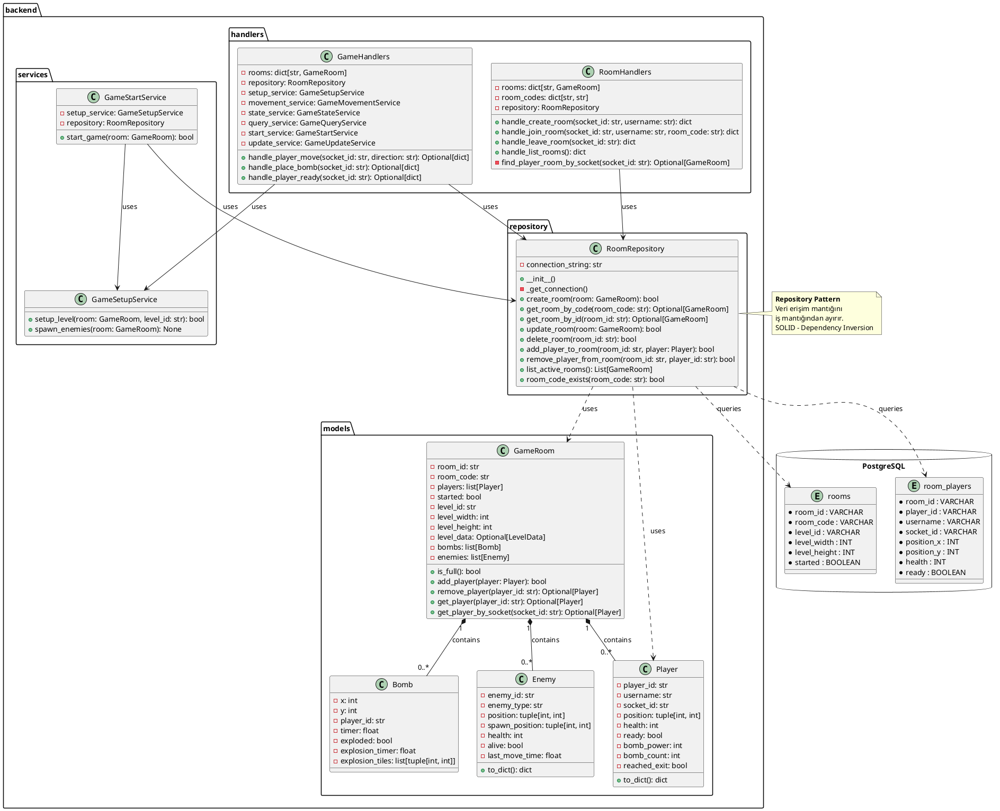
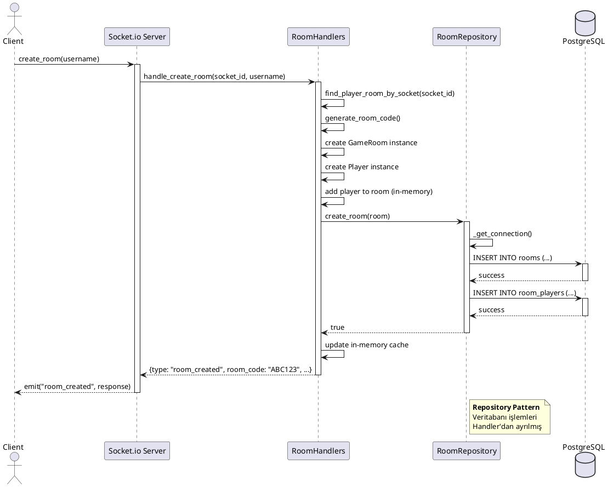
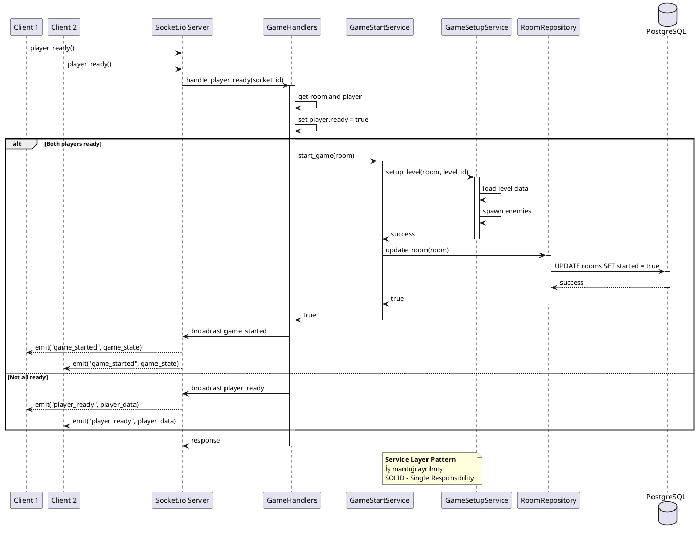

# Backend UML Diagramları

Bu dosya backend mimarisinin UML diagramlarını içerir. PlantUML formatında yazılmıştır.

## PlantUML Kullanımı

PlantUML diagramlarını görüntülemek için:
1. **Online**: [PlantUML Server](http://www.plantuml.com/plantuml/uml/) adresine gidin ve kodları yapıştırın
2. **VS Code**: PlantUML extension'ı yükleyin
3. **GitHub**: GitHub otomatik olarak PlantUML diagramlarını render eder (markdown içinde)

---

## 1. Class Diagram - Repository Pattern

Repository Pattern'in class diagram'ı. `RoomRepository` ve `GameRoom` arasındaki ilişkiyi gösterir.



---

## 2. Component Diagram - Backend Mimarisi

Backend'in genel mimari yapısını gösterir.

```plantuml
@startuml Backend_Component_Diagram

package "Client" {
    [Socket.io Client]
}

package "Backend Server" {
    component [Socket.io Server] as Server {
        [Event Handlers]
    }
    
    component [Room Handlers] as RoomHandlers {
        [handle_create_room]
        [handle_join_room]
        [handle_leave_room]
        [handle_list_rooms]
    }
    
    component [Game Handlers] as GameHandlers {
        [handle_player_move]
        [handle_place_bomb]
        [handle_player_ready]
    }
    
    component [Services] as Services {
        [GameSetupService]
        [GameMovementService]
        [GameStateService]
        [GameQueryService]
        [GameStartService]
        [GameUpdateService]
    }
    
    component [Repository] as Repository {
        [RoomRepository]
    }
    
    database "PostgreSQL" {
        [rooms table]
        [room_players table]
    }
}

[Socket.io Client] --> [Socket.io Server] : WebSocket Connection
[Socket.io Server] --> [Room Handlers] : routes room events
[Socket.io Server] --> [Game Handlers] : routes game events
[Room Handlers] --> [Repository] : data access
[Game Handlers] --> [Repository] : data access
[Game Handlers] --> [Services] : business logic
[Repository] --> [rooms table] : SQL queries
[Repository] --> [room_players table] : SQL queries

note right of Repository
    **Repository Pattern**
    Veri erişim katmanı
    İş mantığından bağımsız
end note

note right of Services
    **Service Layer**
    İş mantığı
    SOLID - Single Responsibility
end note

@enduml
```

---

## 3. Sequence Diagram - Room Oluşturma Akışı

Bir oyuncunun oda oluşturma sürecini gösterir.



---

## 4. Sequence Diagram - Oyun Başlatma Akışı

İki oyuncu hazır olduğunda oyunun başlatılmasını gösterir.



---

## 5. Class Diagram - Service Layer

Service katmanının detaylı class diagram'ı.

```plantuml
@startuml Backend_Service_Layer_Class_Diagram

package "backend.services" {
    class GameSetupService {
        + setup_level(room: GameRoom, level_id: str): bool
        + spawn_enemies(room: GameRoom): None
        - _load_level_data(level_id: str): Optional[LevelData]
    }
    
    class GameMovementService {
        + can_move(room: GameRoom, player: Player, direction: str): bool
        + move_player(room: GameRoom, player: Player, direction: str): bool
        + check_collision(room: GameRoom, x: int, y: int): bool
    }
    
    class GameStateService {
        + serialize_game_state(room: GameRoom): dict
        + deserialize_game_state(data: dict): GameRoom
    }
    
    class GameQueryService {
        - rooms: dict[str, GameRoom]
        + get_room_by_socket(socket_id: str): Optional[GameRoom]
        + get_player_by_socket(socket_id: str): Optional[tuple[GameRoom, Player]]
    }
    
    class GameStartService {
        - setup_service: GameSetupService
        - repository: RoomRepository
        + start_game(room: GameRoom): bool
    }
    
    class GameUpdateService {
        - movement_service: GameMovementService
        - state_service: GameStateService
        - setup_service: GameSetupService
        + update_game(room: GameRoom, delta_time: float): None
        + update_bombs(room: GameRoom, delta_time: float): None
        + update_enemies(room: GameRoom, delta_time: float): None
    }
    
    class BombService {
        + place_bomb(room: GameRoom, player: Player): bool
        + explode_bomb(room: GameRoom, bomb: Bomb): None
        + check_explosion_collision(room: GameRoom, x: int, y: int): bool
    }
    
    class EnemyDamageService {
        + check_enemy_damage(room: GameRoom, explosion_tiles: list): None
        + kill_enemy(room: GameRoom, enemy: Enemy): None
    }
}

package "backend.models" {
    class GameRoom {
        + room_id: str
        + players: list[Player]
        + bombs: list[Bomb]
        + enemies: list[Enemy]
    }
}

package "backend.repository" {
    class RoomRepository {
        + update_room(room: GameRoom): bool
    }
}

GameSetupService --> GameRoom : uses
GameMovementService --> GameRoom : uses
GameStateService --> GameRoom : uses
GameQueryService --> GameRoom : uses
GameStartService --> GameSetupService : uses
GameStartService --> RoomRepository : uses
GameUpdateService --> GameMovementService : uses
GameUpdateService --> GameStateService : uses
GameUpdateService --> GameSetupService : uses
BombService --> GameRoom : uses
EnemyDamageService --> GameRoom : uses

note right of GameSetupService
    **Service Layer Pattern**
    Her service tek bir
    sorumluluğa sahip
    SOLID - Single Responsibility
end note

@enduml
```



---

## Diagram Kullanım Notları

### PlantUML Render Etme

1. **VS Code ile**:
   - PlantUML extension yükleyin
   - `.puml` dosyası oluşturun veya markdown içindeki kodları kopyalayın
   - Preview yapın

2. **Online**:
   - [PlantUML Server](http://www.plantuml.com/plantuml/uml/) adresine gidin
   - Kodları yapıştırın ve görüntüleyin

3. **GitHub**:
   - GitHub otomatik olarak markdown içindeki PlantUML kodlarını render eder
   - Sadece ` ```plantuml ` bloğu kullanın

4. **PNG Export**:
   - PlantUML Server'da "PNG" butonuna tıklayın
   - Veya VS Code extension ile export edin

### Diagram Açıklamaları

- **Class Diagram**: Sınıflar, özellikler, metodlar ve ilişkileri gösterir
- **Component Diagram**: Sistem bileşenleri ve aralarındaki bağımlılıkları gösterir
- **Sequence Diagram**: Zaman içindeki mesaj akışını gösterir

---

## SOLID Prensipleri ve UML

Bu diagramlar SOLID prensiplerine uygun yapıyı gösterir:

- ✅ **Single Responsibility**: Her sınıf/service tek bir sorumluluğa sahip
- ✅ **Dependency Inversion**: Repository Pattern ile veri erişimi soyutlanmış
- ✅ **Open/Closed**: Yeni repository implementasyonu eklemek kolay

---

**Not**: Bu diagramlar backend mimarisini ve Repository Pattern kullanımını gösterir. Design document'te bu diagramları kullanabilirsiniz.

